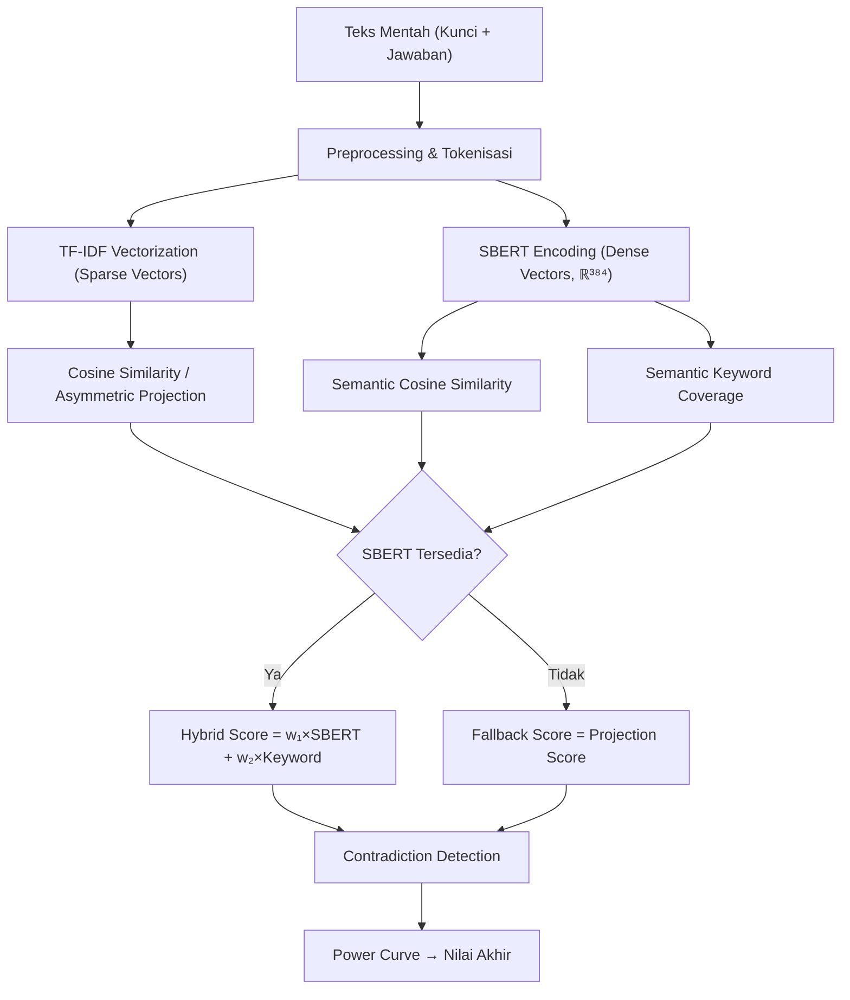
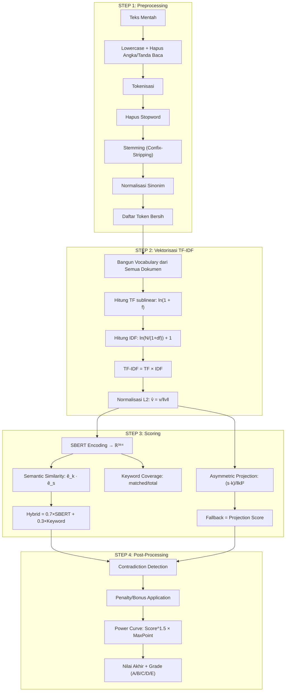

# Landasan Matematika — EssayGrader
## Perhitungan Aljabar Linier untuk Penilaian Esai Otomatis

---

## Daftar Isi
1. [Arsitektur Pipeline Matematis](#1-arsitektur-pipeline-matematis)
2. [Text Preprocessing & Tokenisasi](#2-text-preprocessing--tokenisasi)
3. [Term Frequency (TF)](#3-term-frequency-tf)
4. [Inverse Document Frequency (IDF)](#4-inverse-document-frequency-idf)
5. [TF-IDF Vectorization](#5-tf-idf-vectorization)
6. [Normalisasi L2](#6-normalisasi-l2)
7. [Cosine Similarity (Lexical)](#7-cosine-similarity-lexical)
8. [Asymmetric Projection Score](#8-asymmetric-projection-score)
9. [SBERT Dense Embedding (Semantic)](#9-sbert-dense-embedding-semantic)
10. [Semantic Keyword Coverage](#10-semantic-keyword-coverage)
11. [Hybrid Scoring Formula](#11-hybrid-scoring-formula)
12. [Contradiction Detection & Penalty](#12-contradiction-detection--penalty)
13. [Power Curve & Konversi Nilai Akhir](#13-power-curve--konversi-nilai-akhir)
14. [Confidence Score](#14-confidence-score)
15. [Ringkasan Alur Perhitungan](#15-ringkasan-alur-perhitungan)

---

## 1. Arsitektur Pipeline Matematis

Sistem EssayGrader menggunakan arsitektur **Hybrid Scoring** yang menggabungkan dua pendekatan aljabar linier:



Pipeline ini mengolah teks mentah menjadi representasi vektor dalam ruang berdimensi tinggi, kemudian mengukur kesamaan antar vektor untuk menghasilkan skor numerik.

---

## 2. Text Preprocessing & Tokenisasi

Sebelum masuk ke operasi aljabar linier, teks mentah dikonversi menjadi daftar token yang bersih melalui pipeline:

**Pipeline Preprocessing:**
1. **Case Normalization**: Semua huruf diubah ke lowercase
2. **Pembersihan**: Hapus URL, angka, tanda baca
3. **Tokenisasi**: Pisahkan berdasarkan whitespace → daftar token
4. **Stopword Removal**: Hapus kata-kata fungsional (dan, atau, di, ke, dari, yang, dll.)
5. **Indonesian Stemming**: Hapus imbuhan Bahasa Indonesia menggunakan metode Confix-Stripping

   Aturan prefiks: me-, mem-, men-, meng-, meny-, ber-, be-, di-, ke-, se-, per-, pe-, ter-

   Aturan sufiks: -kan, -an, -i, -nya, -lah, -kah, -pun

6. **Normalisasi Sinonim**: Mengganti sinonim ke bentuk kanonik
7. **Filter Panjang**: Buang token dengan panjang < 3 karakter

**Contoh:**
```
Input:  "Fotosintesis adalah proses pembuatan makanan oleh tumbuhan hijau"
Output: ["fotosintesis", "proses", "buat", "makan", "tumbuh", "hijau"]
```

> [!NOTE]
> Kualitas preprocessing sangat mempengaruhi ketepatan representasi vektor TF-IDF. Token yang telah di-stem dan dinormalisasi akan membentuk dimensi-dimensi dalam ruang vektor.

---

## 3. Term Frequency (TF)

Term Frequency mengukur seberapa sering suatu term muncul dalam sebuah dokumen. Sistem ini mendukung dua mode:

### TF Linier (Standard)

$$
\text{TF}(t, d) = \frac{f(t, d)}{|d|}
$$

dengan:
- *f(t, d)* = frekuensi kemunculan term *t* dalam dokumen *d*
- *|d|* = jumlah total term dalam dokumen *d*

### TF Sublinear (Default)

Untuk mengurangi dominasi term yang sangat sering muncul, sistem menggunakan skala logaritmik:

$$
\text{TF}_{\text{sub}}(t, d) = \ln(1 + f(t, d))
$$

> [!IMPORTANT]
> Sistem menggunakan **sublinear TF** secara default. Ini mencegah term yang muncul berkali-kali (misalnya "dan" yang lolos filter) dari mendominasi vektor secara tidak proporsional.

---

## 4. Inverse Document Frequency (IDF)

IDF mengukur seberapa langka atau penting suatu term di seluruh korpus dokumen. Term yang muncul di hampir semua dokumen mendapat bobot IDF rendah.

$$
\text{IDF}(t) = \ln\left(\frac{N}{1 + \text{df}(t)}\right) + 1.0
$$

dengan:
- *N* = jumlah total dokumen dalam korpus (kunci jawaban + semua jawaban mahasiswa)
- *df(t)* = jumlah dokumen yang mengandung term *t*
- Penambahan 1 pada penyebut (smoothing) mencegah pembagian dengan nol
- Penambahan 1.0 pada hasil memastikan IDF selalu positif

**Properti IDF:**
- Term yang muncul di **semua** dokumen: IDF mendekati 1.0 (bobot rendah)
- Term yang muncul di **sedikit** dokumen: IDF > 1.0 (bobot tinggi, term langka/penting)
- Term yang **tidak muncul** di dokumen manapun: tidak masuk vocabulary

---

## 5. TF-IDF Vectorization

Setiap dokumen direpresentasikan sebagai vektor dalam ruang berdimensi *m* (ukuran vocabulary). Nilai setiap dimensi adalah bobot TF-IDF untuk term yang bersesuaian.

### Konstruksi Vektor TF-IDF

Misalkan vocabulary mengandung *m* term unik: {*t*₁, *t*₂, ..., *t*ₘ}. Untuk dokumen *d*, vektor TF-IDF didefinisikan sebagai:

$$
\vec{v}_d = \begin{pmatrix} w_1 \\ w_2 \\ \vdots \\ w_m \end{pmatrix}
$$

dengan elemen:

$$
w_i = \text{TF}_{\text{sub}}(t_i, d) \times \text{IDF}(t_i)
$$

### Matriks Term-Document

Jika terdapat *n* dokumen, maka seluruh representasi membentuk **Matriks Term-Document** A berukuran *n* × *m*:

$$
A = \begin{pmatrix}
w_{1,1} & w_{1,2} & \cdots & w_{1,m} \\
w_{2,1} & w_{2,2} & \cdots & w_{2,m} \\
\vdots  & \vdots  & \ddots & \vdots  \\
w_{n,1} & w_{n,2} & \cdots & w_{n,m}
\end{pmatrix}
$$

dengan baris ke-*i* merupakan vektor TF-IDF dari dokumen ke-*i*, dan kolom ke-*j* merupakan bobot term ke-*j* di seluruh dokumen.

**Contoh Tabel TF-IDF:**

| Term | TF (Kunci) | IDF | TF-IDF (Kunci) | TF (Jawaban) | TF-IDF (Jawaban) |
|------|-----------|-----|---------------|-------------|-----------------|
| fotosintesis | 0.693 | 1.405 | 0.974 | 0.693 | 0.974 |
| proses | 0.693 | 1.000 | 0.693 | 0.000 | 0.000 |
| cahaya | 0.693 | 1.405 | 0.974 | 0.693 | 0.974 |
| tumbuh | 0.693 | 1.000 | 0.693 | 0.693 | 0.693 |

---

## 6. Normalisasi L2

Setelah konstruksi vektor TF-IDF, setiap vektor dinormalisasi menggunakan norma L2 (Euclidean norm) agar memiliki panjang satuan (unit vector).

### Norma L2

$$
\|\vec{v}\| = \sqrt{\sum_{i=1}^{m} v_i^2}
$$

### Vektor Ternormalisasi

$$
\hat{v} = \frac{\vec{v}}{\|\vec{v}\|}
$$

sehingga $\|\hat{v}\| = 1$

**Tujuan normalisasi:**
- Menghilangkan pengaruh panjang dokumen terhadap skor kesamaan
- Memungkinkan cosine similarity dihitung sebagai **dot product** saja (karena norma = 1)
- Memastikan semua vektor berada pada permukaan unit hypersphere di ℝᵐ

> [!TIP]
> Setelah normalisasi L2, cosine similarity antara dua vektor menjadi setara dengan dot product: cos(θ) = â · b̂ = Σ(âᵢ × b̂ᵢ), karena ‖â‖ = ‖b̂‖ = 1.

---

## 7. Cosine Similarity (Lexical)

Cosine Similarity mengukur sudut antara dua vektor dalam ruang berdimensi tinggi. Nilai cosine similarity tidak bergantung pada panjang vektor, hanya pada **arah** (orientasi) vektor.

### Definisi

Diberikan vektor kunci jawaban **k** dan vektor jawaban mahasiswa **s**, keduanya ∈ ℝᵐ:

$$
\cos(\theta) = \frac{\vec{k} \cdot \vec{s}}{\|\vec{k}\| \times \|\vec{s}\|}
= \frac{\displaystyle\sum_{i=1}^{m} k_i \cdot s_i}{\sqrt{\displaystyle\sum_{i=1}^{m} k_i^2} \times \sqrt{\displaystyle\sum_{i=1}^{m} s_i^2}}
$$

### Interpretasi Geometris

- **cos(θ) = 1**: Kedua vektor searah sempurna (jawaban identik secara leksikal)
- **cos(θ) = 0**: Kedua vektor ortogonal (tidak ada term yang sama)
- **cos(θ) = -1**: Kedua vektor berlawanan arah (secara teoritis, jarang terjadi di TF-IDF)

### Pada Vektor Ternormalisasi

Karena vektor sudah dinormalisasi L2 (‖k̂‖ = ‖ŝ‖ = 1), rumus menjadi:

$$
\cos(\theta) = \hat{k} \cdot \hat{s} = \sum_{i=1}^{m} \hat{k}_i \cdot \hat{s}_i
$$

> [!NOTE]
> Cosine similarity digunakan dalam mode **fallback** (ketika SBERT tidak tersedia) dan juga untuk tujuan tampilan/debug pada mode hybrid.

---

## 8. Asymmetric Projection Score

Sistem ini memperkenalkan **Asymmetric Projection Score** sebagai alternatif cosine similarity standar. Metode ini dirancang agar **jawaban panjang tidak dihukum** selama mengandung konsep-konsep kunci.

### Definisi

$$
\text{proj} = \frac{\vec{s} \cdot \vec{k}}{\|\vec{k}\|^2}
$$

dengan:
- **s** = vektor TF-IDF jawaban mahasiswa (sudah L2-normalized)
- **k** = vektor TF-IDF kunci jawaban (sudah L2-normalized)
- ‖**k**‖² = **k** · **k** = dot product kunci jawaban dengan dirinya sendiri

### Perbedaan dengan Cosine Similarity

| Aspek | Cosine Similarity | Asymmetric Projection |
|-------|------------------|-----------------------|
| **Rumus** | (A·B) / (‖A‖ × ‖B‖) | (s·k) / ‖k‖² |
| **Normalisasi** | Oleh kedua vektor | Hanya oleh vektor kunci |
| **Efek jawaban panjang** | Dihukum (‖B‖ besar → skor kecil) | Tidak dihukum |
| **Fokus** | Kesamaan arah | Cakupan konsep kunci |

### Interpretasi Geometris

Projection score mengukur **seberapa besar komponen vektor jawaban yang jatuh pada arah vektor kunci**. Secara geometris, ini adalah panjang proyeksi vektor **s** ke arah **k**.

$$
\text{proj}_{\vec{k}} \vec{s} = \frac{\vec{s} \cdot \vec{k}}{\|\vec{k}\|^2} \cdot \vec{k}
$$

Nilai skalar projection (yang digunakan sebagai skor):
- **proj = 1.0**: Jawaban mencakup semua konsep kunci dengan proporsi tepat
- **proj > 1.0**: Jawaban melebihi konsep kunci (di-clamp ke 1.0)
- **proj = 0.0**: Tidak ada overlap sama sekali

> [!IMPORTANT]
> Asymmetric Projection digunakan sebagai skor utama dalam **Fallback Mode** (tanpa SBERT). Skor di-clamp ke rentang [0, 1].

---

## 9. SBERT Dense Embedding (Semantic)

Berbeda dengan TF-IDF yang menghasilkan vektor sparse berbasis kemunculan kata, SBERT (Sentence-BERT) menghasilkan vektor dense yang menangkap **makna semantik** kalimat.

### Arsitektur SBERT

Model yang digunakan: `paraphrase-multilingual-MiniLM-L12-v2`

Setiap teks diencode menjadi vektor dense **384 dimensi**:

$$
\text{SBERT}: \text{text} \rightarrow \vec{e} \in \mathbb{R}^{384}
$$

### Encoding dan Normalisasi

Vektor output SBERT langsung dinormalisasi L2 saat encoding:

$$
\hat{e} = \frac{\text{SBERT}(\text{text})}{\|\text{SBERT}(\text{text})\|}
$$

sehingga ‖ê‖ = 1

### Semantic Cosine Similarity

Karena vektor SBERT sudah ternormalisasi, similarity dihitung sebagai dot product:

$$
\text{sim}_{\text{semantic}}(\text{kunci}, \text{jawaban}) = \hat{e}_{\text{kunci}} \cdot \hat{e}_{\text{jawaban}} = \sum_{i=1}^{384} \hat{e}_{\text{kunci},i} \times \hat{e}_{\text{jawaban},i}
$$

### Keunggulan SBERT vs TF-IDF

| Aspek | TF-IDF (Sparse) | SBERT (Dense) |
|-------|-----------------|---------------|
| **Dimensi** | *m* (ukuran vocabulary, variabel) | 384 (tetap) |
| **Representasi** | Kemunculan kata eksak | Makna semantik |
| **Sinonim** | ❌ Tidak terdeteksi | ✅ Terdeteksi |
| **Parafrase** | ❌ Tidak terdeteksi | ✅ Terdeteksi |
| **Bahasa** | Satu bahasa | 50+ bahasa |

**Contoh:**
- TF-IDF: "membuat makanan" vs "menghasilkan glukosa" → similarity **rendah** (kata berbeda)
- SBERT: "membuat makanan" vs "menghasilkan glukosa" → similarity **tinggi** (makna serupa)

---

## 10. Semantic Keyword Coverage

Sistem memecah kunci jawaban menjadi **segmen konsep** dan memeriksa apakah setiap konsep tercakup secara semantik dalam jawaban mahasiswa.

### Segmentasi Konsep

Kunci jawaban dipecah berdasarkan batas kalimat (`.`, `;`, `!`, `?`) dan klausa (`,`):

$$
\text{Kunci} \rightarrow \{c_1, c_2, c_3, \ldots, c_n\}
$$

### Pencocokan Semantik Per-Konsep

Setiap segmen konsep *cᵢ* dan keseluruhan jawaban mahasiswa *A* diencode menggunakan SBERT:

$$
\hat{e}_{c_i} = \text{SBERT}(c_i), \quad \hat{e}_A = \text{SBERT}(A)
$$

Kemudian dihitung cosine similarity antara konsep dan jawaban:

$$
\text{sim}_i = \hat{e}_{c_i} \cdot \hat{e}_A
$$

Konsep dianggap **tercakup** jika:

$$
\text{sim}_i \geq \tau \quad (\tau = 0.85)
$$

### Skor Keyword Coverage

$$
\text{KeywordScore} = \frac{|\{c_i : \text{sim}_i \geq \tau\}|}{n}
= \frac{\text{Jumlah konsep yang cocok}}{\text{Total konsep dalam kunci}}
$$

Skor ini menghasilkan nilai ∈ [0, 1] yang menunjukkan **proporsi konsep kunci yang tercakup** dalam jawaban.

---

## 11. Hybrid Scoring Formula

Skor akhir dihitung menggunakan **Weighted Linear Combination** dari dua komponen:

### Mode Hybrid (SBERT Tersedia)

$$
\text{HybridScore} = w_1 \times \text{sim}_{\text{semantic}} + w_2 \times \text{KeywordScore}
$$

dengan bobot default:
- *w*₁ = **0.7** (bobot SBERT semantic similarity)
- *w*₂ = **0.3** (bobot semantic keyword coverage)
- *w*₁ + *w*₂ = 1.0

$$
\text{HybridScore} = 0.7 \times \text{sim}_{\text{semantic}} + 0.3 \times \text{KeywordScore}
$$

### Mode Fallback (Tanpa SBERT)

$$
\text{FallbackScore} = \text{proj} = \frac{\vec{s} \cdot \vec{k}}{\|\vec{k}\|^2}
$$

Menggunakan Asymmetric Projection Score secara langsung.

### Clamping

Semua skor di-clamp ke rentang [0, 1]:

$$
\text{Score} = \max(0, \min(1, \text{HybridScore}))
$$

---

## 12. Contradiction Detection & Penalty

Setelah skor hybrid dihitung, sistem melakukan **Directional Semantic Analysis** untuk mendeteksi kesalahan fatal yang tidak terdeteksi oleh cosine similarity.

### Tiga Lapisan Deteksi

#### 1. Role Inversion (Inversi Peran Aktor)
Mendeteksi pertukaran Subjek-Objek:
- **Kunci**: "Indonesia dijajah oleh Belanda"
- **Jawaban**: "Belanda dijajah oleh Indonesia"
- → **FATAL**: Peran pelaku dan penderita terbalik

Deteksi dilakukan melalui ekstraksi triple **SVO (Subject-Verb-Object)** dari pola kalimat pasif dan aktif Bahasa Indonesia:
- Pasif: [Patient] + di-[verb] + oleh + [Agent]
- Aktif: [Agent] + me-[verb] + [Patient]

#### 2. Negation Contradiction (Kontradiksi Negasi)
Mendeteksi pembalikan fakta melalui negasi:
- **Kunci**: "Tumbuhan memerlukan cahaya matahari"
- **Jawaban**: "Tumbuhan **tidak** memerlukan cahaya matahari"
- → **FATAL**: Negasi membalik kebenaran

Deteksi: menghitung jumlah kata negasi (tidak, bukan, tanpa, belum, dll.) per klausa. Jika delta jumlah negasi antara kunci dan jawaban **ganjil**, makna terbalik.

$$
\Delta_{\text{neg}} = |N_{\text{neg,kunci}} - N_{\text{neg,jawaban}}|
$$
$$
\text{Terbalik jika } \Delta_{\text{neg}} \mod 2 = 1
$$

#### 3. Directional Reversal (Pembalikan Arah Proses)
Mendeteksi pembalikan arah konversi/proses:
- **Kunci**: "Energi cahaya diubah menjadi energi kimia"
- **Jawaban**: "Energi kimia diubah menjadi energi cahaya"
- → **FATAL**: Arah konversi terbalik

Deteksi melalui ekstraksi pasangan (Sumber, Target) dari pola "dari X ke Y", "X menjadi Y", "X diubah menjadi Y".

### Sistem Penalti

| Verdict | Kondisi | Aksi terhadap Skor |
|---------|---------|---------------------|
| **CONTRADICTION** | ≥1 temuan FATAL | Skor dibatasi maks **0.10** |
| **ENTAILMENT** | Tidak ada kontradiksi + vocabulary overlap rendah | Skor dikalikan **1.00** (bonus parafrase dihapus, bersandar murni pada SBERT) |
| **NEUTRAL** | Tidak ada temuan | Skor **tidak berubah** |

**Formula penalti:**

Untuk CONTRADICTION:
$$
\text{Score}_{\text{adjusted}} = \min(\text{Score}, 0.10)
$$

Untuk ENTAILMENT:
$$
\text{Score}_{\text{adjusted}} = \min(\text{Score} \times 1.00, \; 1.0)
$$

---

## 13. Power Curve & Konversi Nilai Akhir

Setelah semua perhitungan, skor similarity dikonversi menjadi **nilai poin akhir** menggunakan power curve.

### Power Curve

$$
\text{Nilai Akhir} = \left(\text{Score}_{\text{adjusted}}\right)^p \times \text{Poin Maksimal}
$$

dengan:
- *p* = **1.5** (eksponen power curve)
- Poin Maksimal = bobot soal (biasanya 10 atau 100)

### Interpretasi Eksponen

| Eksponen *p* | Efek |
|-------------|------|
| *p* < 1.0 (misal 0.7) | **Generous** — menghargai jawaban parsial, kurva melengkung ke atas |
| *p* = 1.0 | **Linear** — proporsional langsung |
| *p* > 1.0 (misal 1.5) | **Strict** — menghukum jawaban parsial, kurva melengkung ke bawah |

Dengan *p* = 1.5 (Strict):
- Score 0.50 → 0.50¹·⁵ × 10 = **3.54** (bukan 5.0 seperti linear)
- Score 0.80 → 0.80¹·⁵ × 10 = **7.16** (bukan 8.0)
- Score 0.90 → 0.90¹·⁵ × 10 = **8.54** (bukan 9.0)

### Persentase dan Grade

$$
\text{Persentase} = \frac{\text{Nilai Akhir}}{\text{Poin Maksimal}} \times 100\%
$$

| Rentang Persentase | Grade |
|-------------------|-------|
| ≥ 85% | A |
| ≥ 75% | B |
| ≥ 60% | C |
| ≥ 40% | D |
| < 40% | E |

---

## 14. Confidence Score

Sistem juga menghitung **Confidence Score** yang mengindikasikan seberapa yakin sistem terhadap penilaian yang diberikan.

### Mode Hybrid (SBERT)

$$
\text{Confidence} = 0.5 \times \text{sim}_{\text{semantic}} + 0.3 \times \text{KeywordScore} + 0.2 \times \text{LenRatio}
$$

### Mode Fallback (TF-IDF)

$$
\text{Confidence} = 0.7 \times \text{KeywordScore} + 0.3 \times \text{LenRatio}
$$

dengan:

$$
\text{LenRatio} = \frac{\min\left(\frac{|\text{tokens}_{\text{jawaban}}|}{|\text{tokens}_{\text{kunci}}|}, \; 2.0\right)}{2.0}
$$

LenRatio menghargai jawaban yang memiliki panjang setidaknya sebanding dengan kunci jawaban, dengan batas atas 2× panjang kunci.

---

## 15. Ringkasan Alur Perhitungan

Berikut rangkuman seluruh pipeline dari teks mentah hingga nilai akhir:



### Tabel Ringkasan Operasi Aljabar Linier

| No. | Operasi | Rumus | Referensi File |
|-----|---------|-------|----------------|
| 1 | Term Frequency (Sublinear) | TF = ln(1 + f(t,d)) | [vectorizer.py](file:///d:/Download/Project%20Alin%20-%20Copy/engine/core/vectorizer.py#L80-L81) |
| 2 | Inverse Document Frequency | IDF = ln(N/(1+df)) + 1 | [vectorizer.py](file:///d:/Download/Project%20Alin%20-%20Copy/engine/core/vectorizer.py#L56-L60) |
| 3 | TF-IDF Weighting | w = TF × IDF | [vectorizer.py](file:///d:/Download/Project%20Alin%20-%20Copy/engine/core/vectorizer.py#L82) |
| 4 | Normalisasi L2 | v̂ = v / ‖v‖ | [vectorizer.py](file:///d:/Download/Project%20Alin%20-%20Copy/engine/core/vectorizer.py#L83-L86) |
| 5 | Cosine Similarity | cos(θ) = (k·s)/(‖k‖×‖s‖) | [evaluator.py](file:///d:/Download/Project%20Alin%20-%20Copy/engine/core/evaluator.py#L450-L457) |
| 6 | Asymmetric Projection | proj = (s·k)/‖k‖² | [vectorizer.py](file:///d:/Download/Project%20Alin%20-%20Copy/engine/core/vectorizer.py#L171-L197) |
| 7 | Dot Product (SBERT) | sim = ê_k · ê_s | [semantic_model.py](file:///d:/Download/Project%20Alin%20-%20Copy/engine/core/semantic_model.py#L161-L162) |
| 8 | Hybrid Score | S = w₁×SBERT + w₂×Keyword | [evaluator.py](file:///d:/Download/Project%20Alin%20-%20Copy/engine/core/evaluator.py#L347) |
| 9 | Contradiction Penalty | S_adj = min(S, 0.10) | [contradiction_detector.py](file:///d:/Download/Project%20Alin%20-%20Copy/engine/core/contradiction_detector.py#L715-L745) |
| 10 | Power Curve | Nilai = S^1.5 × MaxPoint | [evaluator.py](file:///d:/Download/Project%20Alin%20-%20Copy/engine/core/evaluator.py#L379) |

### Referensi

1. Salton, G. & Buckley, C. (1988). "Term-weighting in Automatic Text Retrieval." *Information Processing & Management*, 24(5), 513–523.
2. Reimers, N. & Gurevych, I. (2019). "Sentence-BERT: Sentence Embeddings using Siamese BERT-Networks." *EMNLP 2019*.
3. Asian, J., Williams, H.E., & Tahaghoghi, S.M.M. (2005). "Stemming Indonesian: A Confix-Stripping Approach."
4. Dagan, I., Glickman, O. & Magnini, B. (2005). "The PASCAL Recognising Textual Entailment Challenge."
5. MacCartney, B. & Manning, C.D. (2008). "Modeling Semantic Containment and Exclusion in NLP."
6. Berry, M.W., Drmač, Z. & Jessup, E.R. (1999). "Matrices, Vector Spaces, and Information Retrieval." *SIAM Review*.
